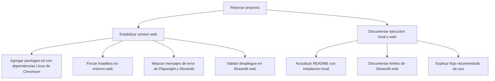

# Plan de trabajo

Estado actual: el alcance queda enfocado en dos formas de uso: ejecucion local con `streamlit run app.py` y despliegue en Streamlit web. No se seguira con empaquetado `.exe` por ahora.

## Orden sugerido

1. Version web estable.
2. README claro para uso local y despliegue.

## Nota

La causa confirmada en Streamlit web fue la falta de librerias Linux para Chromium, empezando por `libglib-2.0.so.0`.
